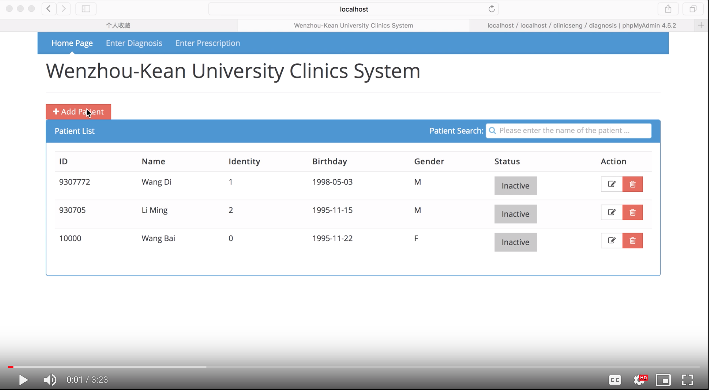

# WKUClinic
This is my undergrad project in Wenzhou-Kean University in 2016. I am responsible for the web-backend and frontend.
- The website is built with AngularJS, Apache Server, PHP, MySQL.

Here is the demo video

